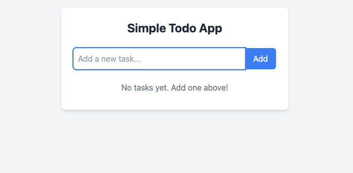

# Next.js Todo App

A simple, lightweight Todo application built with Next.js and Tailwind CSS.

## Features

- Create, toggle, and delete tasks
- Clean, responsive UI using Tailwind CSS
- Built on Next.js App Router architecture
- Keyboard support (Enter to add tasks)
- Visual progress tracking

## Screenshots



## Getting Started

### Prerequisites

- Node.js 18.17.0 or later
- npm or yarn

### Installation

1. Clone the repository:
   ```bash
   git clone https://github.com/abiv23/todo.git
   cd todo
   ```

2. Install dependencies:
   ```bash
   npm install
   # or
   yarn install
   ```

3. Run the development server:
   ```bash
   npm run dev
   # or
   yarn dev
   ```

4. Open [http://localhost:3000](http://localhost:3000) with your browser to see the result.

## Project Structure

```
/todo
  ├── src/
  │   ├── app/
  │   │   ├── globals.css      # Global styles with Tailwind directives
  │   │   ├── layout.js        # Root layout with global CSS imports
  │   │   └── page.js          # Homepage that renders the TodoApp component
  │   └── components/
  │       └── TodoApp.jsx      # Main Todo application component
  ├── public/                  # Static files
  ├── tailwind.config.js       # Tailwind CSS configuration
  ├── postcss.config.js        # PostCSS configuration for Tailwind
  └── package.json             # Project dependencies and scripts
```

## Tech Stack

- [Next.js](https://nextjs.org/) - React framework with App Router
- [Tailwind CSS](https://tailwindcss.com/) - Utility-first CSS framework
- [React](https://reactjs.org/) - UI component library

## Future Enhancements

Potential improvements to consider:

- Task persistence (LocalStorage or database)
- Task categories/tags
- Due dates and reminders
- Task reordering via drag and drop
- Dark/light mode toggle

## License

This project is open source and available under the [MIT License](LICENSE).

## Acknowledgments

- Built with stable versions of Next.js and Tailwind CSS
- Designed for simplicity and ease of use

---

Feel free to contribute, report issues, or suggest improvements!